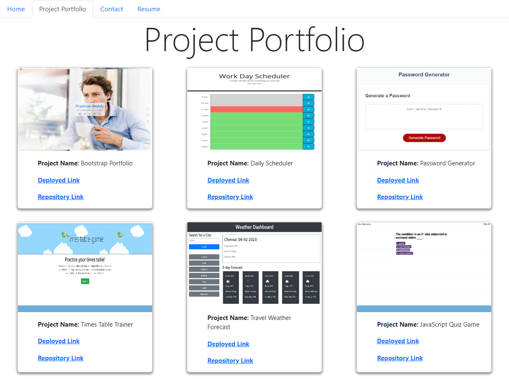
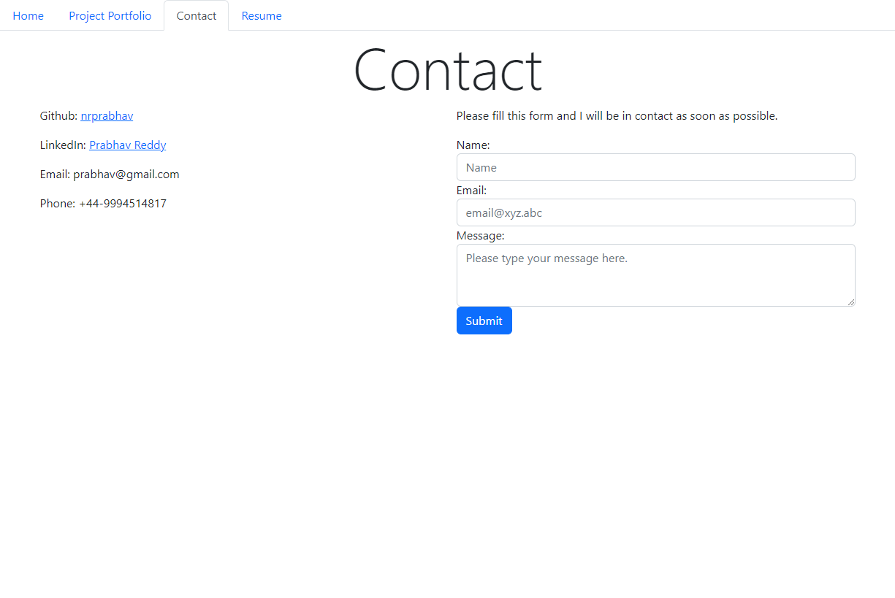
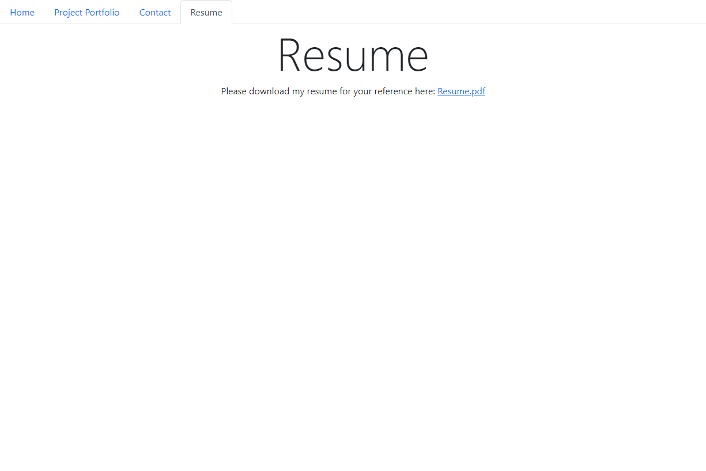

# Prabhav's Tech Portfolio

## Project Links
Repository Link: https://github.com/nrprabhav/prabhav-tech-portfolio
Deployed Link: https://nrprabhav.github.io/prabhav-tech-portfolio

## Description
A javascript code that generates a HTML page with portfolio details in the portfolio.json file.

## Installation
Run 'npm install'

## Features
The code generates a page using react router that displays a project portfolio which has the following parts:
1. Home
2. Project Portfolio
    The project portfolio is generated by using data from the portfolio.json file.
3. Contact
4. Resume
    Allows users to download a pdf resume.

## Outputs
The output HTML file can be generated by running 'npm run start'

## Dependencies
The code uses the following packages:
1. react
2. react-reactor-dom
The packages can be installed by doing the installation as detailed above.

## Screenshots

### Output HTML
#### Home

#### Project Portfolio

#### Contact

#### Resume
